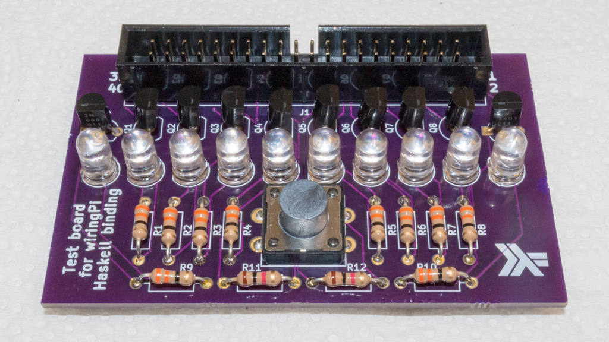

This is a simple add-on board for [Raspberry Pi][1].  It is meant for
testing the [Haskell binding for wiringPi][2].  It connects to the
Raspberry Pi via a 40-pin ribbon cable, and has the following
features:

* [wiringPi pins][3] 0-7 are connected to yellow LEDs

* wiringPi pins 26 and 23 are connected to red LEDs

* wiringPi pins 21 and 22 are connected to each other (via a resistor
  to prevent short circuits) to allow for automated testing (i. e. an
  output pin sending to an input pin)

* wiringPi pin 25 is connected to a momentary pushbutton which pulls
  it to ground via a resistor (so pin should be configured with an
  internal pullup)

The LEDs are driven [with transistors][4] from the 5V supply, to avoid
overloading the 3.3V supply.

This circuit board was designed with [KiCad][5], and was designed to
be fabricated with [OSH Park][6].

* [View schematic](schematic.pdf)
* [View PCB layout][9]
* [Order PCB from Osh Park][10] ($27.40 for three copies of the board,
  and free shipping)

See `digi-key.csv` for Bill of Materials with [Digi-Key][7] part
numbers.  With the 33 ohm resistors, the LEDs are really bright, so
you might want to substitute 68 ohm resistors instead.

This repository is licensed under the
[Creative Commons Attribution-ShareAlike 4.0 International license][8].

[1]: https://www.raspberrypi.org/
[2]: https://hackage.haskell.org/package/wiringPi
[3]: https://pinout.xyz/pinout/wiringpi
[4]: https://electronics.stackexchange.com/questions/60865/how-to-drive-a-20ma-led-from-a-4ma-max-gpio-pin#60868
[5]: http://kicad-pcb.org/
[6]: https://oshpark.com/
[7]: https://www.digikey.com/
[8]: https://creativecommons.org/licenses/by-sa/4.0/
[9]: https://eyrie.io/board/922367d680304403abe881f246e2a430
[10]: https://oshpark.com/shared_projects/bw71UDHZ
